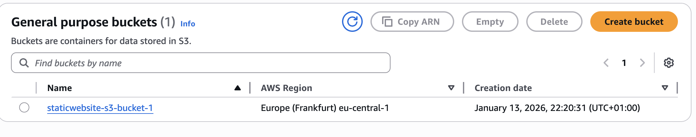
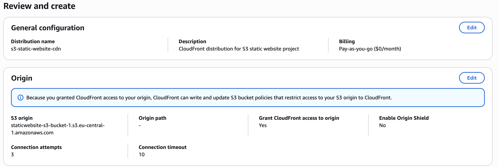
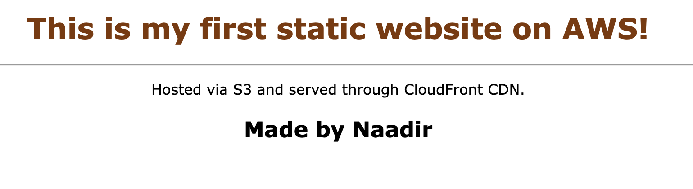

# 3 - Static Website on AWS (S3 + CloudFront + Route53)

## Overview
In this part, I created a simple static website on AWS using S3 and CloudFront.
I learned how to host files publicly in S3, manage access with bucket policies, and improve performance and security by serving content through a CloudFront CDN with HTTPS.

## Steps

### 1. Create Static Website Bucket

I created an S3 bucket to host a simple static website and make it publicly accessible.

1. Create the Bucket
- Bucket name: staticwebsite-s3-bucket-1
- Default region, kept default settings.

2. Enable Static Website Hosting
- Host a static website
- Index document: index.html
- Error document: error.html

3.	Make Objects Public
- Disabled Block all public access
- Added this bucket policy:

```json
{
    "Version": "2012-10-17",
    "Statement": [
        {
            "Sid": "PublicReadGetObject",
            "Effect": "Allow",
            "Principal": "*",
            "Action": "s3:GetObject",
            "Resource": "arn:aws:s3:::staticwebsite-s3-bucket-1/*"
        }
    ]
}
```

Why this matters:
- Allows anyone to read objects (s3:GetObject)
- Makes the website accessible via the S3 endpoint




### 2. Upload Website Files
- Created a simple index.html as the homepage

```html
<html>
<head>
<title>Static Website Project</title>
</head>
<body style="text-align:center;font-family:Verdana;margin:1%;">
<h1 style="color:rgb(128, 55, 0)">This is my first static website on AWS!</h1>
<hr>
<p>Hosted via S3 and served through CloudFront CDN.</p>
<h2>Made by Naadir</h2>
</body>
</html>
```

- Created a simple error.html for errors.
- Uploaded both files to the S3 bucket.


Why this matters:
	•	The index.html is served as the homepage
	•	The error.html is shown if users request a file that doesn’t exist


### 3. Set Up CloudFront

Why set up CloudFront?

- Designed to boost performance by caching your content closer to users at edge locations.
- Instead of users reaching to your original server like a S3 bucket or EC2 Instance or load balancer, the content is cached at the edge locations.
- Reduces load on the original S3 bucket

1.	Chose the S3 bucket as the origin
2.	Enabled compress objects for faster loading
3.	Set Viewer Protocol Policy to Redirect HTTP to HTTPS
4.	Applied CachingOptimized policy to speed up repeated requests




### Result

The website is now live and publicly accessible via the CloudFront distribution.

- Visitors are served content securely over HTTPS, with fast loading thanks to caching at edge locations.
- Both index.html and error.html are working as expected, providing a complete static website setup on AWS.



